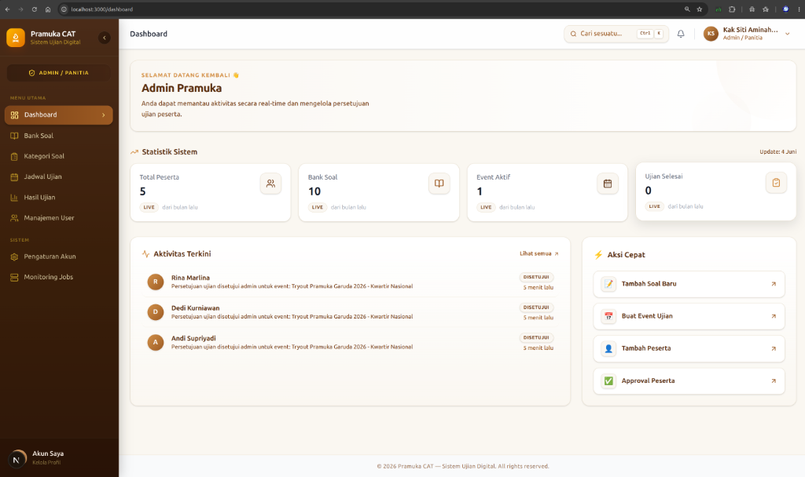
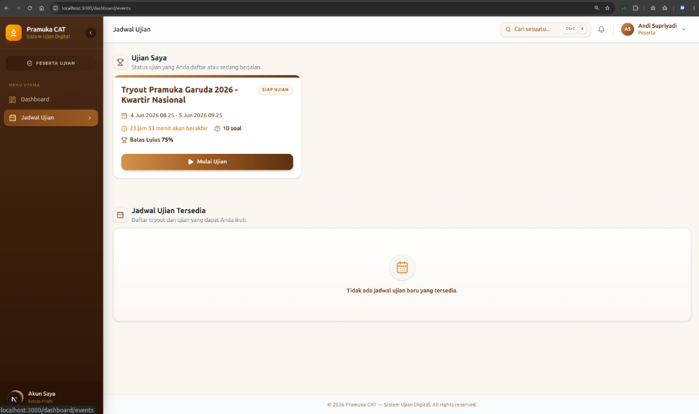
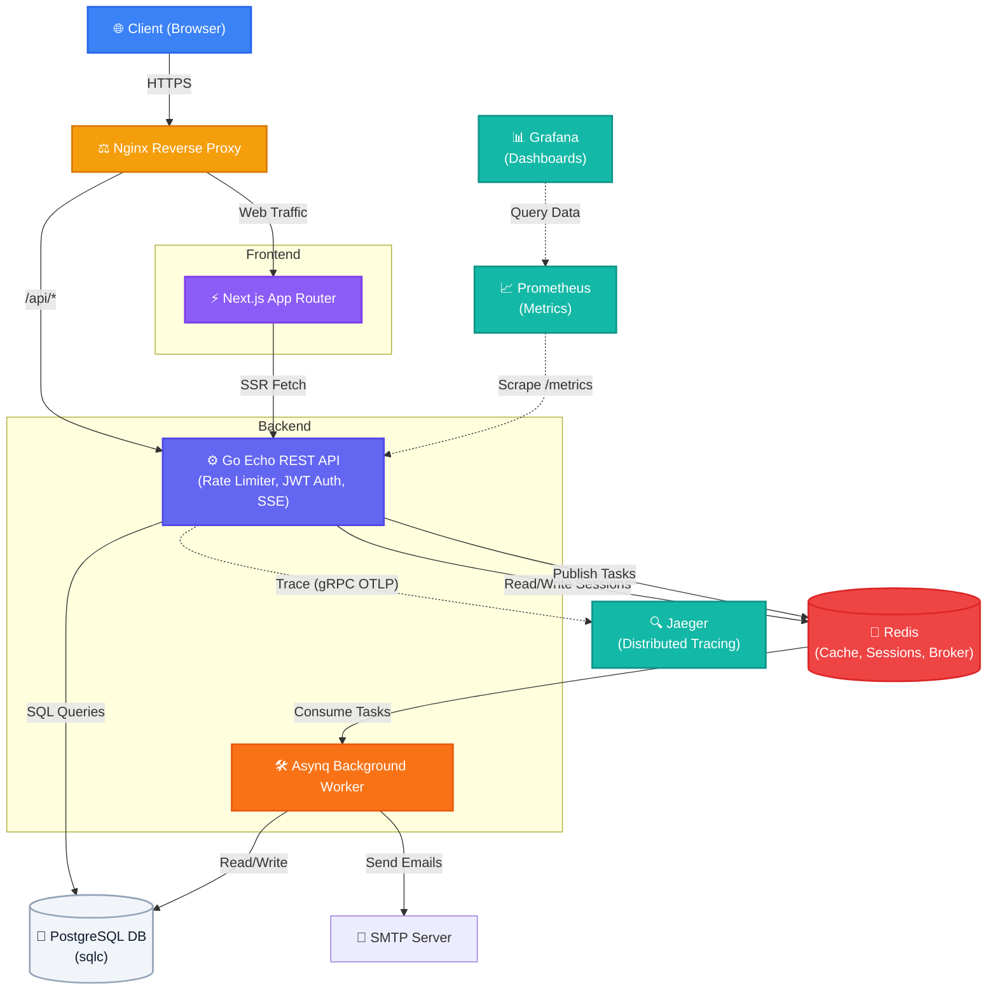

# Pramuka CAT

[](https://golang.org/)
[](https://nextjs.org/)
[](https://www.postgresql.org/)
[](https://redis.io/)
[](https://opensource.org/licenses/MIT)

> Platform ujian berbasis komputer (CAT) untuk kegiatan kepramukaan yang dirancang *highly concurrent* dan tangguh. Dibangun dengan **Go + Echo**, **PostgreSQL**, dan **Redis**.

---

<p align="center">
  
  &nbsp;
  
</p>

---

## Tech Stack

- **Backend:** Go (Echo Framework) · **DB:** PostgreSQL
- **Cache & Message Broker:** Redis (In-Memory Cache untuk sesi/performa, Message Broker untuk *background jobs*)
- **Infra & Observability:** Docker (Containerization) · OpenTelemetry · Jaeger (Distributed Tracing)
- **Background Jobs:** Asynq (Redis-backed) · **Emailing:** SMTP
- **DB Query:** sqlc · **Auth:** Stateful JWT · **Export:** Excel & PDF
- **Testing:** Unit Testing · Integration Testing · **Load Testing:** Grafana k6

---

## 🏛️ Arsitektur Sistem

Berikut adalah gambaran umum arsitektur dari Pramuka CAT:



---

## 🚀 Keunggulan Sistem

### ⚙️ Backend (Golang, PostgreSQL, Redis)
- **Konkurensi**: Dibangun menggunakan **Go (Echo Framework)**. Cukup ringan dan efisien untuk menangani *request* peserta ujian dalam jumlah besar karena memanfaatkan *goroutine*.
- **Penggunaan Redis**: Digunakan untuk dua kebutuhan:
  1. **Message Broker**: Terintegrasi dengan **Asynq** untuk memproses *background jobs* seperti ekspor Excel dan pengiriman email. Hal ini membuat respon API tetap cepat.
  2. **In-Memory Cache**: Digunakan untuk menyimpan data sesi (Stateful JWT), profil pengguna, dan *auto-save* jawaban peserta untuk meminimalisir *query* langsung ke *database*.
- **Docker**: Layanan seperti PostgreSQL, Redis, dan Jaeger sudah dibungkus di dalam *container* menggunakan `docker-compose`. Memudahkan proses instalasi dan *deployment* agar konsisten di berbagai *environment*.
- **Circuit Breaker**: Menggunakan **gobreaker** untuk mencegah penumpukan koneksi jika layanan eksternal (seperti SMTP) sedang bermasalah.
- **Keamanan**: Dilengkapi dengan **Rate Limiter**, perlindungan **Secure Headers**, pembatasan ukuran payload, serta validasi input menggunakan **go-playground/validator**.
- **Observabilitas & Monitoring**: 
  1. Menggunakan **OpenTelemetry** dan **Jaeger** untuk melakukan *distributed tracing*. Memudahkan pelacakan dan pencarian masalah performa mulai dari HTTP masuk hingga *query database*.
  2. Terintegrasi dengan **Prometheus** dan **Grafana** untuk menyajikan dasbor monitoring visual (seperti CPU, RAM, jumlah pengguna login, dan peserta ujian yang sedang aktif) guna menunjukkan kesiapan operasional sistem *(production-readiness)*.
- **Real-Time Data (SSE)**: Backend mengimplementasikan arsitektur **Server-Sent Events (SSE)** untuk memancarkan notifikasi dan pembaruan aliran data secara langsung (satu arah) ke sisi *client* dengan jejak memori yang jauh lebih ringan dibandingkan *WebSockets*.
- **Pemrosesan Data Massal (Bulk Import)**: Mendukung pengunggahan data soal ujian dalam jumlah besar melalui *file* Excel. Sistem memanfaatkan *stream parsing* (menggunakan pustaka `excelize`) dan optimasi kueri *Bulk Insert* tingkat *database*. Hal ini memungkinkan ribuan baris data diproses secara kilat tanpa menyebabkan lonjakan RAM (*Out-of-Memory*) yang bisa membuat *server* *crash*.
- **Database Query (sqlc)**: Tidak menggunakan ORM tradisional yang memakan *resource* tinggi karena proses refleksi (*reflection*). Sistem ini menggunakan **sqlc** untuk mem-*generate* kode Golang murni (*type-safe*) langsung dari sintaks SQL. Hal ini menjamin performa eksekusi kueri sangat cepat layaknya *raw SQL*, serta bebas dari *bug* karena tervalidasi pada saat proses kompilasi (*compile-time validation*).
- **Pengujian (Testing)**: Logika *backend* dicakup oleh *Unit Test* dan *Integration Test*. *Integration testing* menggunakan *database* pengujian yang terpisah (`pramukacat_test`) untuk menyimulasikan alur dari sisi admin hingga peserta.
- **Load Testing**: Performa sistem telah diukur menggunakan **Grafana k6** untuk memastikan API tidak mengalami kendala saat diakses oleh pengguna secara bersamaan.

### 🎨 Frontend (Next.js, Tailwind CSS)
- **Desain UI & Responsivitas**: Dibangun menggunakan **Tailwind CSS** untuk menyajikan antarmuka yang modern, rapi, dan otomatis menyesuaikan (*responsive*) saat dibuka di PC, tablet, maupun *smartphone*.
- **Performa (Rendering & Optimasi)**: Menggunakan **Next.js (App Router)** dengan dukungan **Server-Side Rendering (SSR)**. Halaman diproses terlebih dahulu di server sehingga proses *loading* awal jauh lebih cepat. Fitur bawaan seperti optimasi gambar (*Image Optimization*) dan pemecahan ukuran file (*Code Splitting*) memastikan aplikasi tetap ringan meski diakses menggunakan koneksi terbatas.
- **Keamanan (Security & Akses)**: Dilindungi oleh sistem *middleware* khusus. Halaman rahasia (seperti dasbor admin atau lembar soal) tidak akan bisa dibuka tanpa sesi login dan token JWT yang sah. Input *form* juga divalidasi terlebih dahulu di sisi *frontend* untuk memastikan data yang dikirim selalu bersih.
- **Dashboard Admin Real-Time**: Terintegrasi secara *seamless* dengan koneksi SSE dari *backend*. Setiap kali terdapat pendaftaran peserta baru atau penyelesaian ujian, halaman dasbor (*dashboard*) admin akan langsung memperbarui angka statistik dan notifikasinya dalam hitungan milidetik secara *real-time* tanpa perlu me-*refresh* (*reload*) halaman.
- **Pengalaman Pengguna (UX)**: Menyediakan jalan pintas interaktif (*Command Palette*) yang bisa dipanggil dengan menekan `Ctrl+K`, sehingga staf admin bisa mencari atau pindah antar menu dengan jauh lebih cepat.
- **Stabilitas Fitur Ujian**: Halaman lembar jawaban berjalan secara dinamis. Waktu hitung mundur (*countdown timer*) dan penyimpanan jawaban otomatis (*auto-submit*) ke server terjadi di latar belakang tanpa mengharuskan peserta melakukan *refresh* halaman.

---

## Memulai Cepat

```bash
# 1. Clone & konfigurasi
git clone https://github.com/odealidj/pramuka-CAT.git
cd pramuka-CAT
cp backend/.env.example backend/.env   # Sesuaikan isinya

# 2. Jalankan seluruh sistem (Infra + API)
make up

# 3. Isi data simulasi
make seed
```

API tersedia di: `http://localhost:8080` · Health check: `http://localhost:8080/health`

---

## 🧪 Simulasi Ujian (Dummy Data Seeder)

Jika Anda ingin langsung mencoba aplikasi tanpa perlu menginput data soal dari awal, Anda dapat menjalankan perintah *seeder* kami yang berisi data **Pramuka Realistis**:

```bash
make seed
```
*(Catatan: Jika sewaktu-waktu Anda ingin mengembalikan database ke kondisi bersih dan mengisinya ulang, gunakan perintah `make reset-db`)*

**Data apa saja yang otomatis terbuat?**
1. **Akun Pengguna:**
   - Super Admin: `superadmin` / `superadmin123`
   - Admin Kwartir: `admin_pramuka` / `admin123`
   - Peserta: `peserta1` hingga `peserta5` (semua *password*: `peserta123`)
2. **Bank Soal & Kategori:**
   - Terdapat **10 soal valid** ber-tema Pramuka sungguhan (terbagi dalam kategori: Pengetahuan Umum Kepramukaan, Sandi dan Morse, Sejarah Kepramukaan).
3. **Event Ujian:**
   - Akan otomatis dibuat jadwal "Tryout Pramuka Garuda 2026 - Kwartir Nasional" yang sedang berstatus *LIVE*.
   - Peserta 1 hingga 3 akan otomatis terdaftar dan di-*approve*.
   - Simulasi data jawaban (*dummy answers*) otomatis dimasukkan seolah-olah peserta sedang mengerjakan ujian.

Anda bisa langsung *login* sebagai **Admin** untuk melihat *Dashboard Statistik*, atau *login* sebagai **Peserta** (`peserta1`) untuk mencoba sensasi menjawab soal-soal kepramukaan!

## Perintah Make

| Perintah | Deskripsi |
|---|---|
| `make up` / `make down` | Jalankan / hentikan seluruh sistem (Docker) |
| `make infra-up` / `make infra-down` | Nyalakan hanya infrastruktur (untuk debug Go lokal) |
| `make run` | Jalankan API Go langsung di host |
| `make migrate-up` / `make migrate-down` | Jalankan / rollback migrasi database |
| `make seed` / `make clear-seed` | Tambah / hapus data simulasi |
| `make reset-db` | Reset penuh: rollback → migrate → seed |
| `make test` | Jalankan unit test biasa |
| `make test-integration` | Jalankan E2E Integration Test penuh (beserta reset test-db) |
| `make sqlc` | Re-generate kode dari query SQL |

---

## 📚 Dokumentasi API

Untuk memudahkan integrasi dan pemahaman alur data backend, referensi daftar endpoint API yang tersedia dapat dilihat pada dokumen terpisah berikut:

👉 **[Lihat Dokumentasi API (API_REFERENCE.md)](docs/API_REFERENCE.md)**

*Catatan: Jika server lokal dijalankan, dokumentasi interaktif (Swagger UI) juga dapat diakses melalui `http://localhost:8080/swagger/index.html`.*

---

## 📈 Laporan Pengujian Kinerja (Performance Test Report)

Untuk membuktikan ketangguhan arsitektur backend sistem **Pramuka CAT**, kami telah melakukan serangkaian pengujian beban (*load testing*) menggunakan **Grafana k6** secara langsung pada API backend yang terhubung dengan **Redis Cache** dan **PostgreSQL**.

### 1. Skenario Pengujian (User Journey Simulation)
Setiap *Virtual User (VU)* dalam k6 menyimulasikan perjalanan lengkap seorang peserta ujian pramuka sesungguhnya:
1. Melakukan **Health Check** (`GET /health`) untuk memastikan status server siap.
2. Melakukan **Login Peserta** (`POST /api/v1/auth/login`) menggunakan kredensial ter-seed (`peserta1 / peserta123`).
3. Mengambil **Daftar Ujian Aktif** (`GET /api/v1/protected/exams/upcoming`) dari cache/database.
4. Membaca **Profil Peserta** (`GET /api/v1/protected/profile`).
5. Memiliki jeda berpikir acak (*think time*) antara 1–3 detik sebelum memulai iterasi berikutnya untuk mensimulasikan sifat manusiawi.

---

### 2. Hasil Pengujian Beban (Load Test Results)

Kami menjalankan 2 skenario pengujian utama pada localhost:

#### A. Smoke Test (Sanity Check)
* **Konfigurasi:** 1 Virtual User (VU) aktif terus-menerus selama 10 detik.
* **Tujuan:** Memastikan seluruh alur kode, token JWT, autentikasi stateful di Redis, dan database query berjalan mulus tanpa kegagalan (0% error).
* **Hasil Empiris:**
  * **Total Checks:** 25 dari 25 berhasil (**100% Success Rate**).
  * **Rata-rata Waktu Respons (Latency):** `16.47 ms` (Median: `1.33 ms`, Tercepat: `419.4 µs`).
  * **Http Request Failure Rate:** `0.00%` (0 gagal dari 20 request).
  * **Status Checks:**
    * `✓ health is status 200`
    * `✓ login is status 200`
    * `✓ has token`
    * `✓ get exams is status 200`
    * `✓ get profile is status 200`

#### B. Load Test (Concurrency & Security)
* **Konfigurasi:** 50 Virtual Users (VU) serentak selama 1 menit.
* **Tujuan:** Simulasi lalu lintas ujian yang padat dan menguji pertahanan *Rate Limiter* (Anti-DDoS).
* **Hasil:**
  * **Total Requests:** `5.054 req` (Rata-rata `83.2 req/sec`).
  * **Latensi Normal:** Rata-rata `16.52 ms`. Performa tetap stabil tanpa kebocoran memori (*goroutine leak*).
  * **Rate Limiter Aktif:** `76.37%` request dari IP yang sama (melebihi batas 20 req/detik) berhasil diblokir secara instan (`317 µs`) dengan *HTTP 429*, sehingga mengamankan server dari serangan *spam*.

#### C. Stress Test (Kapasitas Maksimal)
* **Konfigurasi:** 500 hingga 1.000 Virtual Users.
* **Tujuan:** Mengukur batas atas arsitektur server dan efektivitas *Redis Caching*.
* **Hasil 500 VU:**
  * Throughput: **204 request/sec** dengan **100% Success Rate**.
  * Latensi P95: **1.9 detik** (Sangat responsif di bawah batas aman 3 detik, berkat *Cache-Hit*).
* **Hasil 1.000 VU:**
  * Throughput: **92 request/sec** dengan **100% Success Rate**.
  * Latensi P95: melambat hingga **11.5 detik**.
  * *Catatan Analisis:* Meskipun tidak ada pesan gagal (0% error), pelambatan ini murni disebabkan oleh *bottleneck* pada CPU saat melakukan kalkulasi enkripsi **bcrypt** dari 1.000 pengguna yang melakukan *login* di waktu bersamaan. Ke depan, layanan autentikasi ini perlu dipisah menjadi *microservice* tersendiri jika target *traffic* melampaui 1.000 pengguna serentak di perangkat *server* bertenaga rendah.

---

### 3. Kesimpulan Teknis

1. **Keandalan Golang**: Sistem terbukti stabil menangani ratusan *request* serentak berkat *goroutine* tanpa menghasilkan *error* sama sekali.
2. **Performa Redis**: Penggunaan *Redis* terbukti krusial dalam menyelamatkan *database* (PostgreSQL) dari kelebihan beban, menjaga latensi 95% pengguna tetap di bawah 2 detik.
3. **Limitasi CPU (Bcrypt)**: Pengujian ini berhasil memetakan bahwa enkripsi *password* adalah titik lemah (*bottleneck*) utama CPU. Temuan ini menjadi *insight* penting untuk merancang arsitektur penskalaan (*scaling*) berikutnya.
4. **Keamanan Maksimal**: Fitur *Rate Limiter* bawaan bekerja dengan sangat optimal menangkis serangan *spam request* dari alamat IP yang mencurigakan, menjaga *resource* memori agar tidak jebol.

